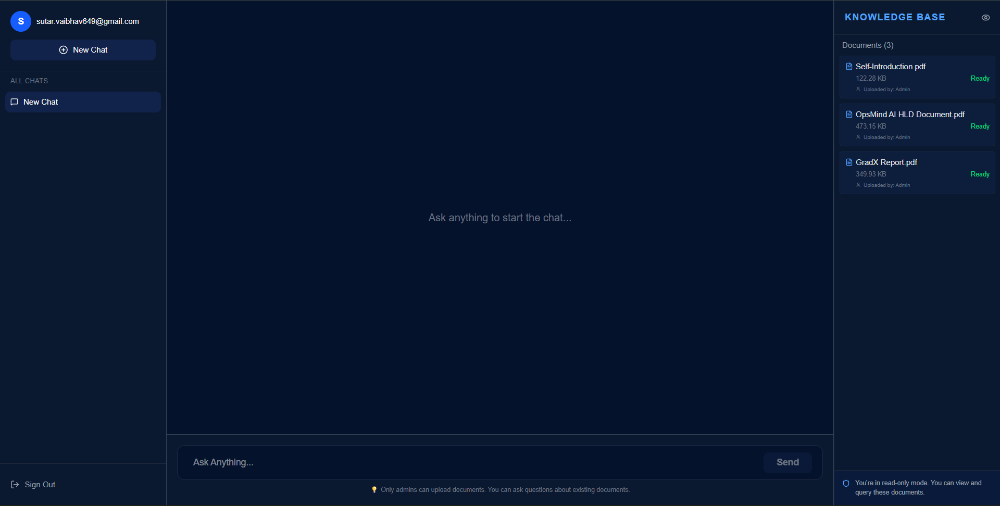
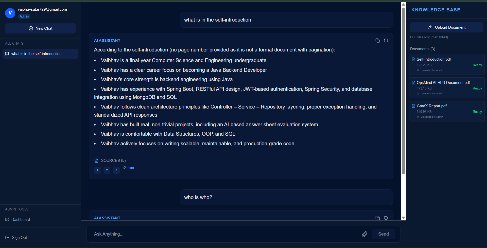
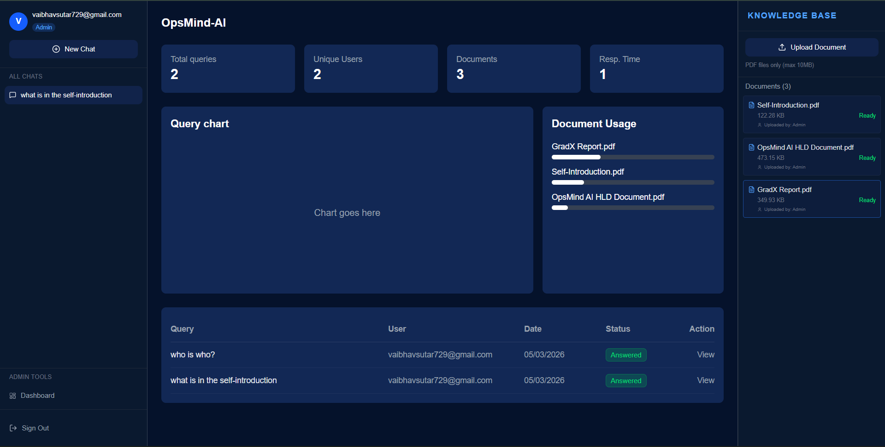

# OpsMind AI - Enterprise SOP Knowledge Assistant

<div align="center">
  <h3>Context-Aware Corporate Knowledge Assistant</h3>
  <p>A RAG-based system that helps employees instantly find answers from corporate documents</p>
</div>

<p align="center">
  
  
  
  
  
  
  
  
</p>

---

## Table of Contents
- [Project Overview](#project-overview)
- [Key Features](#key-features)
- [Features Completed](#features-completed)
- [Application Preview](#application-preview)
- [Tech Stack](#tech-stack)
- [Getting Started for Contributors](#getting-started-for-contributors)
  - [Prerequisites](#prerequisites)
  - [Clone the Repository](#clone-the-repository)
  - [Cloning Your Fork](#cloning-your-fork)
- [Development Setup](#development-setup)
  - [Docker Setup](#docker-setup)
  - [Local Setup](#local-setup)
  - [Environment Variables](#environment-variables)
- [Project Structure](#project-structure)
- [System Architecture](#system-architecture)
- [Contributors](#contributors)
- [License](#license)
- [Acknowledgements](#acknowledgements)

---

## Project Overview

OpsMind AI is an intelligent knowledge assistant that helps employees instantly find answers from corporate documents (HR policies, SOPs, manuals, etc.). It uses RAG (Retrieval Augmented Generation) to provide accurate, cited answers with a critical **"hallucination guardrail"** - the AI will explicitly say "I don't know" if the answer isn't in the knowledge base.

### Key Features:
| Feature | Description |
|---------|-------------|
| **Document Ingestion** | Upload PDF documents (Admin only) |
| **Semantic Search** | Vector embeddings for intelligent retrieval |
| **Real-time Chat** | Streaming responses with typing indicator |
| **Precise Citations** | Source documents, page numbers, confidence scores |
| **Admin Dashboard** | Knowledge graph with usage analytics |
| **Hallucination Guardrail** | "I don't know" for out-of-scope questions |
| **Role-Based Access** | Admins upload, all users query |

---
## Features Completed
   - ✅ Document ingestion pipeline|
   - ✅ PDF chunking and embeddings
   - ✅ MongoDB vector search retrieval
   - ✅ Streaming AI chat responses
   - ✅ Citation reference cards
   - ✅ Chat history persistence
   - ✅ Admin analytics dashboard
   - ✅ Query analytics system

---
## Future Improvements
  - Query analytics graph visualization
  - Document summarization
  - Mobile responsive UI
  - Multi-document conversation context
  - Feedback system for AI answers

## Application Preview
### User Chat Interface
<p align="center">  </p>

### Admin Chat Interface 
<p align="center">  </p>

### Admin Dashboard
<p align="center">  </p>

### Citations
<p align="center">  </p>

## Tech Stack

| Layer | Technology | Purpose |
|-------|------------|---------|
| **Frontend** | React 18, Tailwind CSS, Vite | Chat UI, streaming, admin dashboard |
| **Backend** | Node.js 20, Express, Multer | API routes, file uploads |
| **Database** | MongoDB Atlas + Vector Search | Document storage, vector similarity |
| **AI/ML** | OpenRouter (LLaMA 3.1), text-embedding-3-small | Response generation, embeddings |
| **Queue** | BullMQ + Redis (Memurai for Windows) | Background PDF processing |
| **Auth** | JWT, bcrypt | Authentication, role management |
| **DevOps** | Docker, Docker Compose | Containerization, deployment |

---

## Getting Started for Contributors

### Prerequisites

Before you begin, ensure you have the following installed:

| Tool | Version | Download |
|------|---------|----------|
| **Git** | 2.30+ | [Download](https://git-scm.com/downloads) |
| **Docker Desktop** | 24.x+ | [Download](https://www.docker.com/products/docker-desktop) |
| **Node.js** | 20.x | [Download](https://nodejs.org/) (for local setup) |
| **Memurai** | Latest | [Download](https://www.memurai.com/) (Windows Redis alternative) |
| **MongoDB Compass** | Latest | [Download](https://www.mongodb.com/products/compass) (Optional) |

### Repository Setup

#### Step 1: Accept GitHub Invitation

1. Check your email for the GitHub invitation
2. Click "Accept invitation"
3. You'll get access to the repository

#### Step 2: Clone the Repository

**Using GitHub Website:**
1. Go to: `https://github.com/sutarvaibhav649/opsmind-ai`
2. Click the **Fork** button (top-right)
3. Select your GitHub account
4. Wait for fork to complete

**Using GitHub CLI:**
```bash
git clone https://github.com/YOUR_USERNAME/opsmind-ai.git
cd opsmind-ai
```
**Backend Setup**
```bash
  cd backend
  npm install
  npm run dev
```
**Frontend Setup**
```bash
  cd frontend
  npm install
  npm run dev
```

---


# Development Setup
## Docker Compose setup
add the required api keys and urls in .env file of root folder
```bash
    MONGODB_URI="you mongodb uri"
    JWT_SECRET="you JWT secret 32 bits"
    OPENROUTER_API_KEY="you api key for models"
```
---
## Local Setup
If you don't want to use the docker compose then you can also run this project localy 
Add following enviornment variables in ```opsmind-ai/backend/.env ```  file
```bash
# Server
PORT=5000
NODE_ENV=development

# MongoDB Atlas
MONGODB_URI="your MONGODB_URI"
OPENROUTER_API_KEY="your api key"

# File Upload
MAX_FILE_SIZE=10485760
UPLOAD_PATH=./uploads

REDIS_HOST=localhost
REDIS_PORT=6379

JWT_SECRET="Your JWT secret key"

```
and in ```opsmind-ai/frontend/.env ```
```bash
VITE_API_URL=http://localhost:5000
```

## Project Structure
```bash
  |opsmind-ai
  |--backend/
      |--src
      |   |--config
      |   |--controllers
      |   |--middleware
      |   |--models
      |   |--queues
      |   |--routes
      |   |--services
      |   |--utils
      |   |--app.js
      |   |--server.js
      |--uploads              --all uploaded pdfs
      |--Dockerfile
  |--frontend/
      |--src
      |   |--components
      |   |   |--chat
      |   |   |--sidebar
      |   |--config
      |   |--context
      |   |--layout
      |   |--pages
      |   |--services
      |   |--utils
      |   |--App.jsx
      |   |--main.jsx
      |   |--MainLayout.jsx
      |--Dockerfile
  |--docs/
      |--architecture
      |--overview
      |--screenshots
```
---
## System Architecture
The system follows a Retrieval Augmented Generation (RAG) pipeline.
```text
                User Query
                    │
                    ▼
                Node.js API
                    │
                    ▼
                MongoDB Vector Search
                    │
                Retrieve Top Document Chunks
                    │
                    ▼
                Context + Query
                    │
                    ▼
                LLM (Gemini / OpenRouter)
                    │
                    ▼
                Streaming Response
                    │
                    ▼
                React Chat UI
```
---
## Contributors
  <a href="https://github.com/sutarvaibhav649">Vaibhav Sutar</a><br>
  <a href="https://github.com/SRD-web">Sai Jupalle</a>

---
## License
This project is licensed under the MIT License.

## Acknowledgements
This project was developed as part of an AI Innovation Lab internship project focused on building enterprise AI knowledge assistants.